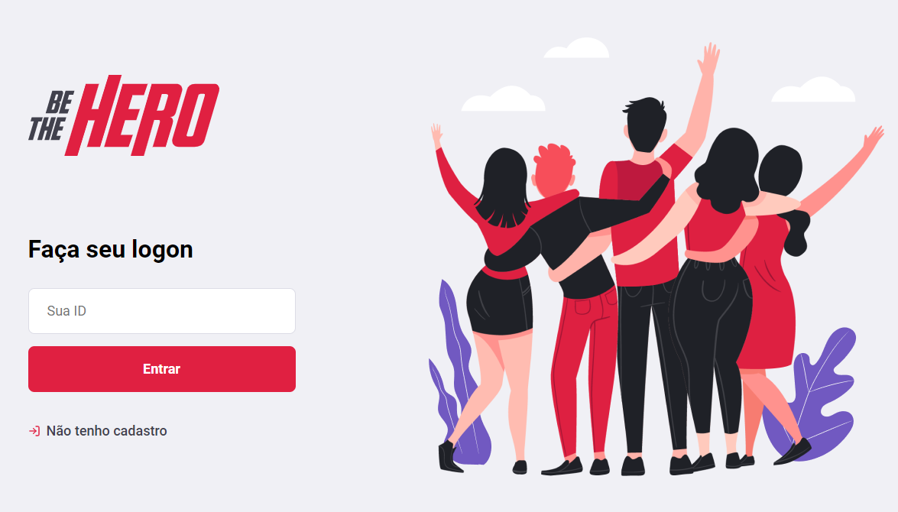
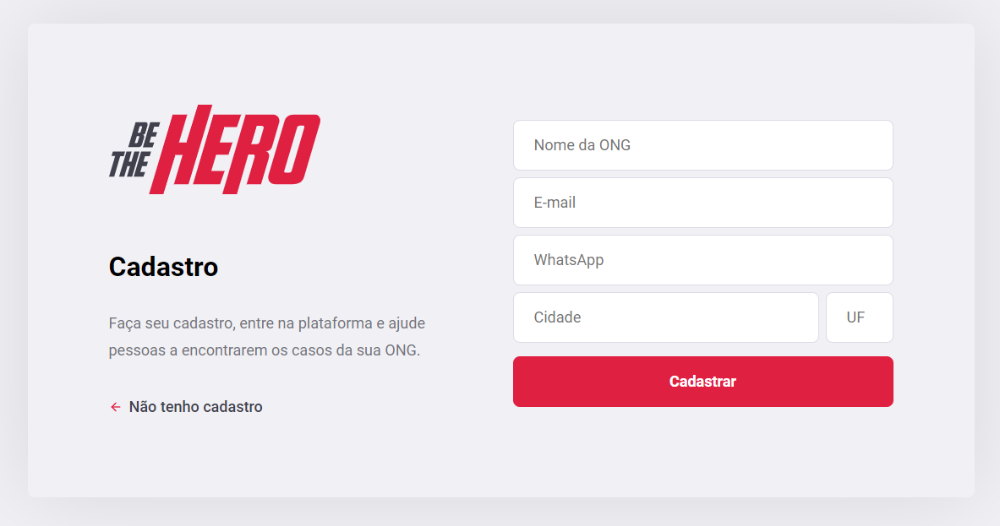
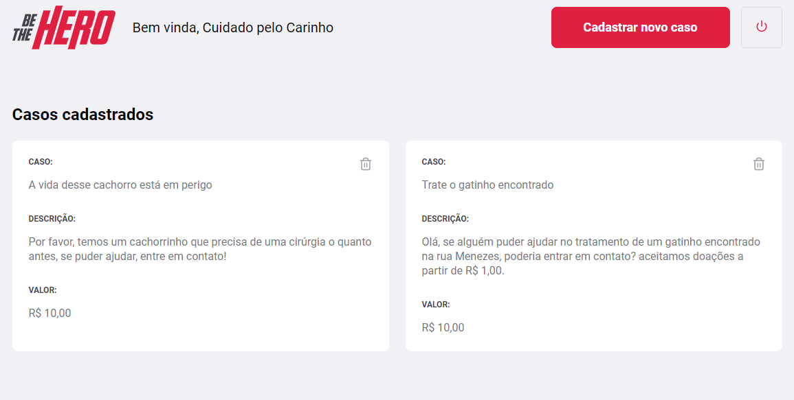
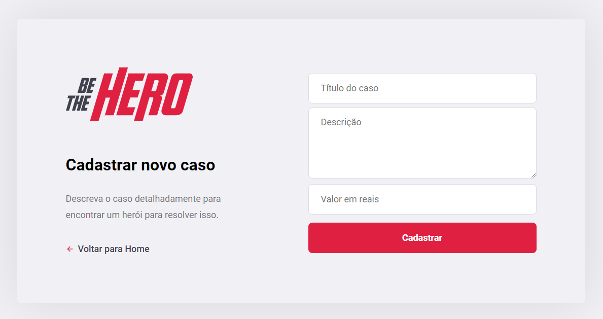
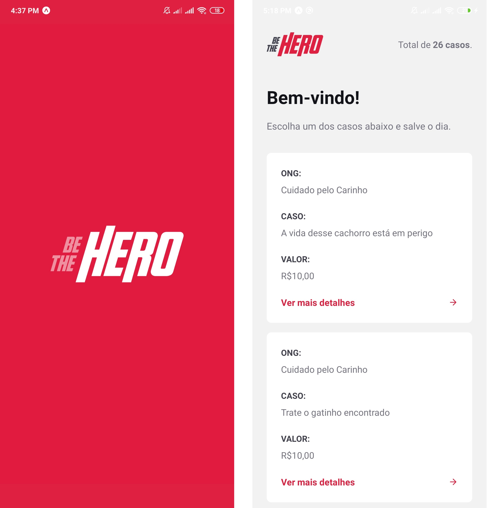

<h1 align="center">
    
</h1>

<h4 align="center">
  🚀 Semana OmniStack 11.0
</h4>

  <a href="#rocket-tecnologias">Tecnologias</a>&nbsp;&nbsp;&nbsp;|&nbsp;&nbsp;&nbsp;
  <a href="#-projeto">Projeto</a>

 

## :rocket: Tecnologias

Esse projeto foi desenvolvido com as seguintes tecnologias:

- [Node.js](https://nodejs.org/en/)
- [React](https://reactjs.org)
- [React Native](https://facebook.github.io/react-native/)
- [Expo](https://expo.io/)

## 💻 Projeto

O Be the Hero é um projeto que facilita a vida das ONGs e voluntários, nossos protagonistas, com o unico propósito de salvarem o dia de cada ser nesta terra, o usuário pode visualizar casos publicados por ONGs e entrar em contato com elas via E-mail ou WhatsApp, o unico trabalho da ONG fica em se cadastrar, e compartilhar seu pedido de ajuda para que seja visualizado por um herói.

  

  

  

  

  

  

